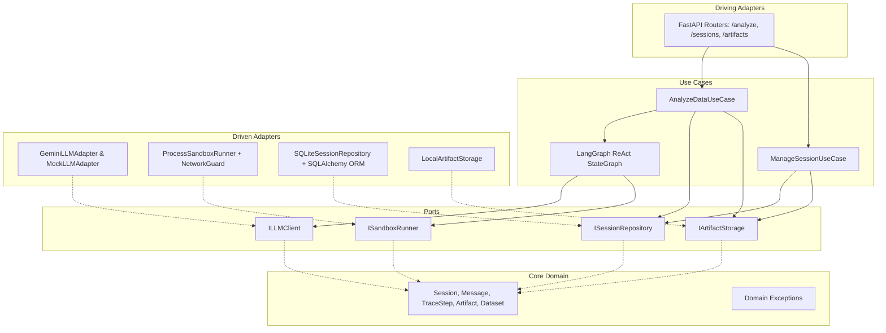
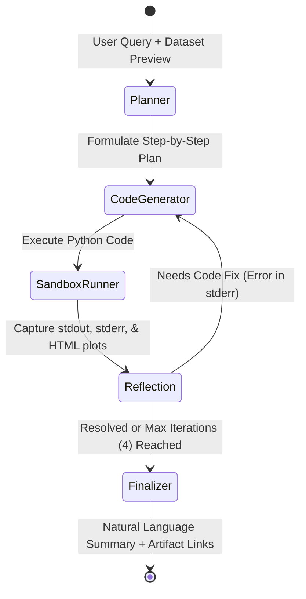

# ReAct Data Analysis Service

A production-ready, testable, and robust ReAct-style Data Analysis Service following **Hexagonal Architecture (Ports and Adapters)** powered by **LangGraph**, **SQLite**, **FastAPI**, and **Google Gemini API**.

---

## 1. System Architecture

The codebase enforces strict inward dependency flow:
$$\text{Adapters} \longrightarrow \text{Use Cases} \longrightarrow \text{Ports} \longrightarrow \text{Core Entities}$$

Neither the core domain logic nor the LangGraph agent state machine depends on FastAPI, SQLite, or external cloud SDKs.



---

## 2. ReAct Agent Loop & Self-Healing State Machine

The analysis engine executes an iterative **Plan $\rightarrow$ Act $\rightarrow$ Observe $\rightarrow$ Recover** loop compiled with **LangGraph**:



### Self-Healing Guarantee
If generated code raises an error (e.g. `KeyError`, `ValueError`, `TypeError`), the **Reflection Node** catches the failure and routes execution back to **Code Generator** with the full error feedback and previous code, enabling automated code correction without failing the request.

---

## 3. Key Design Decisions

### A. Datastore Choice: SQLite with SQLAlchemy 2.0
- **Why SQLite?**
  - **Zero Daemon Overhead**: Unlike PostgreSQL or MySQL, SQLite runs entirely in-process, eliminating background database containers and saving memory (crucial for resource-constrained 1024MB environments).
  - **ACID Compliance & Multi-Turn Resumption**: Provides full transactional integrity across sessions, messages, traces, and artifacts. Sessions persist across server restarts and container recreations via persistent volume mounts.
  - **Simplicity & Portability**: The single `.db` file can be backed up, inspected, or tested with zero external configuration.

### B. API Contract Design
- **Why Multipart `POST /analyze`?**
  - Allows transmitting an analytical question and a CSV dataset file in a single atomic HTTP request without requiring pre-upload orchestration.
  - Supports optional `session_id` to chain conversational turns on an existing dataset.
  - Returns a unified JSON payload containing the natural language answer, interactive artifact links (`/artifacts/{id}`), and the step-by-step reasoning trace.
- **RESTful Resource Access**:
  - `GET /sessions/{id}` retrieves historical context, messages, and all generated artifacts.
  - `GET /artifacts/{id}` streams raw Plotly HTML directly with `media_type="text/html"`, enabling in-browser visual rendering.

### C. Sandbox Isolation Strategy
- **Why Process-Level Isolation with Network Neutralization?**
  - **Pragmatic & Lightweight**: Spawning a separate Python subprocess per step in a clean `tempfile.TemporaryDirectory()` avoids the complexity, latency, and privileges required for Docker-in-Docker or VM-level sandboxing.
  - **Timeout Kill**: Enforces a strict 15-second execution timeout. If exceeded, the entire subprocess tree is terminated (`SandboxTimeoutError`), preventing infinite loops or CPU exhaustion.
  - **Filesystem Isolation**: Code executes inside an isolated temporary directory; input datasets are copied locally so host files cannot be overwritten.
  - **Network Guard**: Socket calls (`connect`, `create_connection`, `urllib.request`, `http.client`) are monkey-patched at the subprocess bootstrap level to raise `PermissionError`, preventing external data exfiltration.


---

## 4. API Specification

### Endpoints

| Method | Path | Description |
| :--- | :--- | :--- |
| `POST` | `/analyze` | Run ReAct data analysis over an uploaded CSV or existing session dataset. |
| `GET` | `/sessions/{id}` | Retrieve session history, full reasoning traces, and artifact links. |
| `GET` | `/sessions` | List recent conversation sessions. |
| `GET` | `/artifacts/{id}` | Stream the standalone Plotly HTML visualization (`media_type="text/html"`). |
| `GET` | `/health` | Service health status check. |

### Sample `POST /analyze` Request (cURL)

```bash
curl -X POST "http://localhost:8000/analyze" \
  -F "question=What is the total revenue by product category? Generate an interactive chart." \
  -F "file=@data/sample_sales.csv"
```

### Sample Response Payload

```json
{
  "session_id": "9b1deb4d-3b7d-4bad-9bdd-2b0d7b3dcb6d",
  "answer": "The highest revenue category is Electronics with $3,700 across 32 units sold. An interactive bar chart has been generated.",
  "artifacts": [
    {
      "id": "e4eaaaf2-d142-11e1-b3e4-080027620cdd",
      "file_name": "output_plot.html",
      "url": "/artifacts/e4eaaaf2-d142-11e1-b3e4-080027620cdd"
    }
  ],
  "trace": [
    {
      "step_index": 1,
      "thought": "1. Inspect data. 2. Group by category and sum revenue. 3. Output Plotly bar chart.",
      "code": "import pandas as pd\nimport plotly.express as px\n...",
      "stdout": "Category Revenue:\nElectronics: 3700.0\n",
      "stderr": null,
      "duration_seconds": 0.42
    }
  ]
}
```

---

## 5. Getting Started

### Prerequisites
- Python 3.11+
- Google Gemini API Key (get one from [Google AI Studio](https://aistudio.google.com/))

### Native Setup (Virtualenv)

1. **Clone and setup environment**:
   ```bash
   git clone https://github.com/armando-mio/AI-ML-Engineer-Technical-Assignment.git
   cd AI-ML-Engineer-Technical-Assignment
   python -m venv .venv
   source .venv/bin/activate  # On Windows: .venv\Scripts\activate
   pip install -r requirements.txt
   ```

2. **Configure environment variables**:
   ```bash
   cp .env.example .env
   # Edit .env and supply your GEMINI_API_KEY
   ```

3. **Run the server**:
   ```bash
   uvicorn data_agent.adapters.api.app:app --host 0.0.0.0 --port 8000 --reload
   ```
   Interactive Swagger docs are available at: `http://localhost:8000/docs`.

---

## 6. Running with Docker Compose

Run the entire service inside a resource-constrained container (1024MB memory limit):

```bash
# 1. Set your Gemini API key
export GEMINI_API_KEY="your-api-key"

# 2. Build and start service
docker compose up --build -d

# 3. View logs
docker compose logs -f
```

The service will be live on `http://localhost:8000`.

---

## 7. Automated Testing Suite

Execute the full suite of unit, integration, and E2E tests:

```bash
python -m pytest -v
```

### Coverage Highlights:
- **Unit (`tests/unit/`)**: Domain aggregate invariants, exceptions, LangGraph state machine transitions, and Step 1 `KeyError` $\rightarrow$ Step 2 self-healing recovery.
- **Integration (`tests/integration/`)**: Subprocess timeout kill (1.5s enforcement), network guard neutralization (blocking `socket` and `urllib`), filesystem isolation, Plotly HTML extraction, and SQLite session persistence.
- **E2E (`tests/e2e/`)**: FastAPI `TestClient` verifying multipart CSV upload, `/analyze` response schema, `/sessions/{id}`, and `/artifacts/{id}` HTML streaming.

### Strategy for Testing Non-Deterministic LLM Components
To ensure 100% test reliability and zero flakiness in production CI/CD:
1. **Hexagonal Port Decoupling**: The core domain and LangGraph use cases interact exclusively with the abstract `ILLMClient` port, never importing concrete vendor SDKs.
2. **Deterministic Mocking (`MockLLMAdapter`)**: Replaces external LLM calls with scripted plans, code snippets, evaluations, and summaries. This allows testing edge cases (e.g. syntax errors, `KeyError` recovery, maximum iteration limits) deterministically without network latency, API costs, or quota throttling.
3. **Contract and Schema Invariance**: Tests assert on architectural invariants (state machine node transitions, structured trace step shapes, JSON schemas, and valid HTML output) rather than asserting on exact natural language phrasing.
4. **Isolated Security Guarantees**: Sandbox safety tests (execution timeout kill, socket blocking, and filesystem confinement) execute actual Python subprocesses with real injected guards, verifying security independently of LLM outputs.

---

## 8. Deliverables Included

1. **Complete Source Code**: Hexagonal Architecture layout under `data_agent/` (Core, Ports, Use Cases, Adapters, API).
2. **README Documentation**: Full architectural diagrams, key design justifications, and test/run guides.
3. **Example Plotly HTML Output**: Pre-generated interactive chart saved at [`examples/example_plot.html`](examples/example_plot.html).
4. **Sample Dataset**: Clean transactional CSV dataset at [`data/sample_sales.csv`](data/sample_sales.csv).
5. **Docker Infrastructure**: [`Dockerfile`](Dockerfile) and [`docker-compose.yml`](docker-compose.yml).
6. **Automated Test Suite**: 14 tests in `tests/` covering unit, integration, and E2E.

---

## 9. Known Limitations & Future Improvements

1. **Multi-File Datasets**: Current implementation mounts a single primary tabular dataset per session. Future work could support zip archives with multi-table relational schema joins.
2. **Containerized Worker Pools**: For extreme enterprise untrusted code execution, process-level isolation can be upgraded to microVM-based sandboxes (e.g. Firecracker or gVisor) alongside the current network neutralization.
3. **Streaming Trace Updates**: Add Server-Sent Events (SSE) or WebSockets to stream reasoning steps and stdout in real-time as the agent iterates through the ReAct loop.

