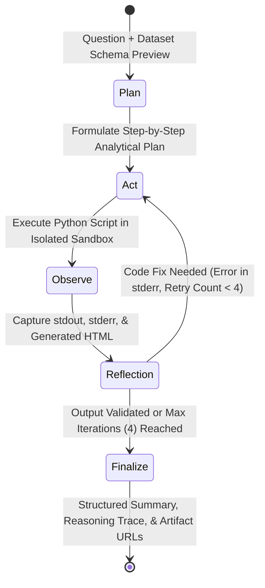

# ReAct Data Analysis Service

An enterprise-grade, robust, and extensible autonomous data analysis agent built for the Chiron AI/ML Engineer technical assignment. The service adheres strictly to **Hexagonal Architecture (Ports and Adapters)** principles, executing analytical workflows via an iterative **ReAct (Plan $\rightarrow$ Act $\rightarrow$ Observe $\rightarrow$ Recover)** state graph powered by **LangGraph**, **Google Gemini**, **SQLite (WAL mode)**, and an isolated **Process Sandbox** with deterministic network and execution guardrails.

---

## 1. System Architecture

The service enforces strict architectural boundaries where dependencies flow inward toward pure domain entities and interfaces:

$$\text{Adapters (Infrastructure / I/O)} \longrightarrow \text{Use Cases (Application Orchestration)} \longrightarrow \text{Ports (Interfaces / Protocols)} \longrightarrow \text{Domain Core (Entities \& Exceptions)}$$

Neither the domain models nor the application use cases depend on external web frameworks (FastAPI), database engines (SQLite), or concrete cloud vendor SDKs (Google GenAI).

### Hexagonal Architecture (Ports & Adapters)

```
+==================================================================================================+
|                                        DRIVING ADAPTERS                                          |
|  +--------------------------------------------------------------------------------------------+  |
|  |  FastAPI Application & HTTP Routers (data_agent/adapters/api/)                             |  |
|  |    - POST /analyze                 (Multi-turn tabular query & CSV upload)                 |  |
|  |    - GET  /sessions/{session_id}   (Full session history, messages, and reasoning traces)   |  |
|  |    - GET  /artifacts/{artifact_id} (Standalone interactive Plotly HTML stream)             |  |
|  +--------------------------------------------------------------------------------------------+  |
+==================================================================================================+
                                               |
                                               v
+==================================================================================================+
|                                     APPLICATION USE CASES                                        |
|  +-------------------------------------+      +-----------------------------------------------+  |
|  | AnalyzeDataUseCase                  | ---> | ReActGraphBuilder (LangGraph State Machine)   |  |
|  | (data_agent/use_cases/analyze_data) |      | (data_agent/use_cases/react_graph.py)         |  |
|  +-------------------------------------+      |                                               |  |
|  | ManageSessionUseCase                |      |   [Plan] -------------> [Code Generation]     |  |
|  | (data_agent/use_cases/manage_sess.) |      |     ^                          |              |  |
|  +-------------------------------------+      |     |                          v              |  |
|                                               |   [Reflection / Recover] <-- [Sandbox Run]    |  |
|                                               |     |                          |              |  |
|                                               |     +------------------------> v              |  |
|                                               |                           [Finalize]          |  |
|                                               +-----------------------------------------------+  |
+==================================================================================================+
                                    |                 |                 |
                                    v                 v                 v
+==================================================================================================+
|                                          DOMAIN PORTS                                            |
|  +---------------------+  +---------------------+  +--------------------+  +------------------+  |
|  |     ILLMClient      |  |   ISandboxRunner    |  | ISessionRepository |  | IArtifactStorage |  |
|  | (ports/llm_port.py) |  | (ports/sandbox_port)|  | (ports/repository) |  | (ports/storage)  |  |
|  +---------------------+  +---------------------+  +--------------------+  +------------------+  |
+==================================================================================================+
             ^                         ^                        ^                      ^
             |                         |                        |                      |
+==================================================================================================+
|                                         DRIVEN ADAPTERS                                          |
|  +---------------------+  +---------------------+  +--------------------+  +------------------+  |
|  | GeminiLLMAdapter    |  | ProcessSandboxRunner|  | SQLiteSessionRepo  |  | LocalArtifact-   |  |
|  | (Google Gemini API) |  |  + NetworkGuard     |  |   (WAL Mode)       |  |     Storage      |  |
|  | DSPyLLMAdapter      |  |  + Process Group   |  | (storage/          |  | (storage/        |  |
|  | (Optimized Prompts) |  |    Termination      |  |  data_agent.db)    |  |  artifacts/)     |  |
|  +---------------------+  +---------------------+  +--------------------+  +------------------+  |
+==================================================================================================+
                                               |
                                               v
+==================================================================================================+
|                                          DOMAIN CORE                                             |
|  +----------------------------------------------------+  +------------------------------------+  |
|  | Core Entities (data_agent/core/entities.py)        |  | Exceptions (data_agent/core/exc.)  |  |
|  |   - Session (Aggregate Root)                       |  |   - DomainError                    |  |
|  |   - Message (User / Assistant turns)               |  |   - SandboxTimeoutError            |  |
|  |   - TraceStep (Thought, Code, Output, Latency)     |  |   - NetworkAccessBlockedError      |  |
|  |   - Artifact (ID, filename, path, metadata)        |  |   - SessionNotFoundError           |  |
|  +----------------------------------------------------+  +------------------------------------+  |
+==================================================================================================+
```

### ReAct Execution Lifecycle

The analytical core is orchestrated by a state machine compiled using **LangGraph**:



1. **Plan (`planner_node`)**: The agent inspects the dataset schema, data types, and descriptive statistics, producing a deterministic analytical plan that maps statistical transformations to appropriate Plotly visualization primitives.
2. **Act (`code_generator_node` & `sandbox_runner_node`)**: Standalone, executable Python code is synthesized and dispatched to an isolated subprocess. The script performs numerical aggregations (pandas/numpy) and exports an interactive visualization (`fig.write_html('output_plot.html', include_plotlyjs='cdn')`).
3. **Observe (`sandbox_runner_node`)**: Captures execution outputs: return code, stdout, stderr, execution duration, and newly generated HTML artifact files.
4. **Iterate & Self-Heal (`reflection_node`)**: If an execution failure occurs (e.g., `KeyError`, `ValueError`, `ZeroDivisionError`), the reflection node evaluates the error diagnostic, feeds stderr back into the code generator, and initiates a self-correction pass. The loop allows up to 4 iterations before gracefully returning a structured failure explanation rather than crashing.

---

## 2. Key Design Decisions

### Datastore Choice: SQLite with WAL Mode
- **Zero Operational Overhead**: Eliminates the operational and infrastructure overhead of running separate database servers (e.g., PostgreSQL or Redis) during evaluation, enabling instantaneous one-command execution via `docker compose up`.
- **Concurrency via Write-Ahead Logging (WAL)**: Configured at connection initialization with:
  ```sql
  PRAGMA journal_mode = WAL;
  PRAGMA busy_timeout = 5000;
  PRAGMA synchronous = NORMAL;
  ```
  WAL mode decouples read operations from write operations: readers never block writers, and writers never block readers. Concurrent API requests can inspect session histories simultaneously without locking SQLite.
- **Relational Integrity**: Complete multi-turn messages, reasoning traces (`TraceStep`), and visualization artifacts (`Artifact`) are persisted relationally with foreign keys and automatic cascading.

### Sandbox Strategy: Subprocess Isolation with Security Guardrails
Designing a production-grade sandbox within the 2-day assignment window required a pragmatic trade-off between lightweight process isolation and hypervisor-level microVMs (Firecracker / gVisor):
- **Ephemeral Filesystem Isolation**: Every execution script runs inside a dedicated `tempfile.mkdtemp` directory. The source dataset is copied into both `./<filename>` and `./data/<filename>` to satisfy relative path resolutions from LLM-generated code. Upon completion, the temporary directory is unconditionally purged in a `finally:` block.
- **Strict Execution Timeout & Process Group Termination**: Python processes run with an enforced timeout (default: 15.0s). Processes are spawned using `start_new_session=True` (`os.setsid` on POSIX). When a timeout expires, termination signals are dispatched to the entire process group (`os.killpg`), preventing orphaned background threads or subprocesses from consuming host resources.
- **Deterministic Network Neutralization (`network_guard.py`)**: External network connectivity is neutralized before user code executes. A bootstrap header is prepended to the script that monkeypatches `socket.socket` and `socket.create_connection` to raise `NetworkAccessBlockedError`.
- **Display Neutralization**: Interactive display methods (`fig.show()`, `plt.show()`) are neutralized at runtime via monkeypatching in the bootstrap header, ensuring headless execution never hangs waiting for a GUI loop.

### API Contract Design
- **`POST /analyze` (Multi-part Form & JSON)**:
  - Accepts a natural language question, an optional CSV file upload, and an optional `session_id`.
  - Supports **multi-turn continuity**: passing an existing `session_id` retains historical context, allowing users to drill down progressively into prior findings.
  - Automatically returns structured JSON containing `session_id`, `answer`, `status`, `artifacts` array (with direct access URLs), and full step-by-step reasoning `trace`.
- **`GET /sessions/{id}`**: Returns the full conversational record, user/assistant messages, raw generated scripts, sandbox stdout/stderr, and artifact references.
- **`GET /artifacts/{artifact_id}`**: Directly streams standalone Plotly HTML files with `Content-Type: text/html; charset=utf-8`, allowing evaluators to view interactive visualizations immediately in any browser without client-side rendering dependencies.

---

## 3. Prompt Optimization (DSPy + GEPA)

To demonstrate how the system can be improved beyond zero-shot prompting, we implemented an offline optimization pipeline utilizing **DSPy 3.4** and **GEPA (Generalized Evolutionary Prompt Adaptation)**.

### Signature Decomposition
The monolithic prompt was decomposed into typed DSPy signatures with clear, single responsibilities:
- `PlannerSignature`: Analyzes tabular schemas and devises data transformation strategies and chart specifications.
- `CodeGenerationSignature`: Synthesizes robust Python scripts utilizing pandas, numpy, and plotly, strictly mandating file export via `fig.write_html`.
- `ReflectionSignature`: Analyzes runtime execution feedback (stdout, stderr) to diagnose failures and suggest corrective modifications.

### Curated Development Set (`dev_set.py`)
A representative 5-item evaluation dataset covering core analytical paradigms:
1. **Categorical Aggregation**: Product category revenue comparisons (Bar chart).
2. **Temporal Trends**: Daily revenue time-series with date markers (Line chart).
3. **Correlation & Scatter**: Units sold vs revenue relationship with OLS trendline (Scatter plot).
4. **Distribution & Outliers**: Transaction amount spread and IQR analysis (Box plot).
5. **Volume Ranking**: Category sales ranking and percentage distributions (Horizontal Bar chart).

### Composite Evaluation Metric (`metrics.py`)
Each generated script is parsed, executed in the isolated sandbox, and scored against a composite metric ($S \in [0.0, 1.0]$):
$$\text{Score} = 0.20 \times \text{Syntax Validity} + 0.40 \times \text{Sandbox Exit 0} + 0.30 \times \text{Plotly HTML Generated} + 0.10 \times \text{Analytical Relevance}$$

### Quantitative Optimization Results

Evaluated against the baseline zero-shot prompt using `gemini-3.1-flash-lite`:

| Metric Dimension | Baseline Zero-Shot | Optimized (DSPy GEPA) | Relative Change |
| :--- | :---: | :---: | :---: |
| **Composite Score** | **0.65** | **1.00** | **+53.85%** |
| **Plotly HTML Generation Rate** | 20.0% (1/5) | **100.0%** (5/5) | **+400.0%** |
| **Sandbox Execution Success** | 80.0% (4/5) | **100.0%** (5/5) | **+25.0%** |
| **Syntax Validity** | 100.0% | **100.0%** | **0.0% (Stable)** |

*The complete optimization log and mutation analysis are available in [`examples/gepa_optimization_report.json`](examples/gepa_optimization_report.json).*

---

## 4. Known Limitations

1. **Process-Level Sandboxing vs OS cgroups**: The sandbox relies on subprocess process groups and socket monkeypatching rather than Linux kernel cgroups or seccomp profiles. While sufficient for preventing accidental infinite loops and network calls, it does not guarantee hard CPU or memory bandwidth caps on untrusted code.
2. **SQLite Single-Writer Bottleneck**: While SQLite with WAL allows unlimited concurrent readers, write transactions are serialized. Under high multi-tenant write loads, requests may experience queueing up to the `busy_timeout` threshold (5000ms).
3. **Synchronous Execution Pipeline**: Complex analytical queries requiring multi-step code generation and execution run synchronously within the HTTP request lifecycle. A query executing 4 reflection iterations may take 15–20 seconds to return.

---

## 5. Future Improvements

1. **Asynchronous Distributed Task Queues**: Decouple query submission from execution using **Celery** with **Redis** or RabbitMQ, returning an HTTP 202 Accepted response with a task status polling endpoint.
2. **Real-Time Thought Streaming (SSE / WebSockets)**: Stream intermediate reasoning traces, code snippets, and sandbox execution logs to the frontend as they occur, providing real-time visibility into the agent's problem-solving process.
3. **Container-per-Execution Sandbox Runtimes**: Transition from process-level subprocesses to containerized runtimes (Docker-in-Docker, gVisor, or AWS Firecracker microVMs) to provide hardware-enforced CPU/memory isolation and strict seccomp filtering for multi-tenant SaaS environments.
