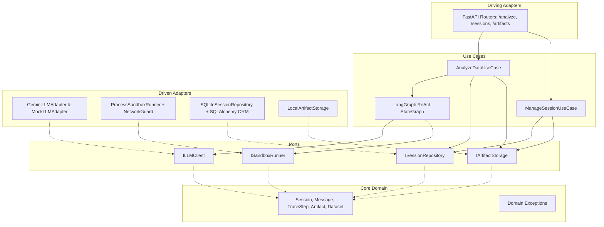
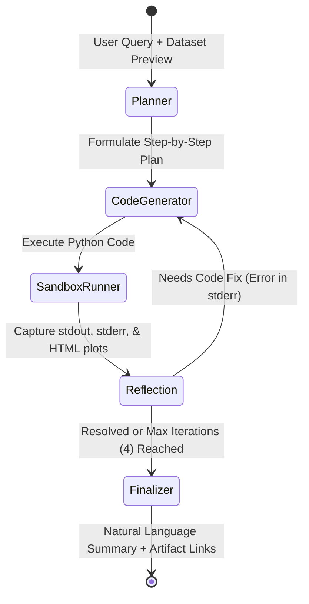

# ReAct Data Analysis Service

A production-ready, testable, and robust ReAct-style Data Analysis Service following **Hexagonal Architecture (Ports and Adapters)** powered by **LangGraph**, **SQLite**, **FastAPI**, and **Google Gemini API**.

---

## 1. System Architecture

The service enforces a strict inward dependency direction:
$$\text{Adapters} \longrightarrow \text{Use Cases} \longrightarrow \text{Ports} \longrightarrow \text{Core Entities}$$

Neither the core domain logic nor the LangGraph agent state machine depends on FastAPI, SQLite, or external cloud SDKs.



### ReAct Agent Loop & Self-Healing State Machine
The analysis engine executes an iterative **Plan $\rightarrow$ Act $\rightarrow$ Observe $\rightarrow$ Recover** loop compiled with **LangGraph**:



- **Self-Healing Recovery**: If the generated Python code raises runtime or syntax errors (e.g. `KeyError`, `ValueError`), the **Reflection Node** catches the failure and routes execution back to **Code Generator** with error feedback and the previous code, correcting the execution without crashing the service.

---

## 2. Key Design Decisions

### A. Why this Datastore (SQLite with SQLAlchemy 2.0)
- **Zero Daemon Overhead**: Unlike PostgreSQL or MySQL, SQLite runs in-process with zero extra container bloat and minimal memory footprint, making it ideal for the 1024MB RAM budget.
- **ACID-Compliant State & Resumption**: Supports multi-turn conversations, historical trace retrieval, and generated artifact references across service restarts via persistent volume mounts.
- **Portability & Simplicity**: The entire database state resides in a single file (`storage/data_agent.db`), trivial to mount, back up, or test in-memory (`sqlite:///:memory:`).

### B. Why this API Contract (FastAPI + Multipart `/analyze`)
- **Single-Flight Atomic Submissions**: The `POST /analyze` endpoint accepts `multipart/form-data`, allowing the user to submit an analytical prompt and a new CSV dataset file in one atomic request without separate upload ceremonies.
- **Autonomous Plotly Visualization Mandate**: The client does not need to explicitly instruct the agent to "generate a chart" or mention Plotly in the query. The ReAct agent autonomously determines and executes the optimal interactive Plotly visualization for every analytical query as a core feature of the service.
- **Conversational Resumption**: Accepts an optional `session_id` to continue multi-turn analysis over an existing dataset without re-uploading the file.
- **Comprehensive Response Payload**: Returns a unified JSON schema containing the natural language answer, direct URLs to generated visualizations (`/artifacts/{id}`), and the step-by-step reasoning trace (thought, code, stdout, stderr, duration).
- **Direct HTML Streaming**: `GET /artifacts/{id}` streams standalone Plotly HTML files (`media_type="text/html"`), allowing immediate in-browser rendering.

### C. Why this Sandbox Strategy (Subprocess Isolation + Network Neutralization)
- **Pragmatic Security without Over-Engineering**: Spawning a separate Python subprocess inside an isolated `tempfile.TemporaryDirectory()` avoids the complexity, latency, and host privileges needed for Docker-in-Docker or VM-level sandboxes.
- **Strict Timeout Enforcement**: A hard execution timeout (15s default) terminates the entire subprocess tree upon expiry, raising `SandboxTimeoutError` to prevent infinite loops or CPU starvation.
- **Filesystem Isolation**: Code executes inside an isolated temporary directory; input datasets are copied locally so host files cannot be overwritten.
- **Network Neutralization**: Sockets (`socket.socket.connect`, `socket.create_connection`, `urllib.request`, `http.client`) are patched at startup by `network_guard.py` to immediately raise `PermissionError`, preventing data exfiltration or SSRF.

### D. Strategy for Testing Non-Deterministic LLM Components
- **Hexagonal Port Decoupling**: Core domain logic and use cases depend exclusively on the abstract `ILLMClient` port, never importing vendor SDKs directly.
- **Deterministic Mocking (`MockLLMAdapter`)**: Replaces external LLM calls with deterministic, scripted responses for testing state transitions, self-healing error recovery, and schema output consistency with zero network flakiness, latency, or API costs.
- **Contract & Schema Invariance**: Assertions validate structural invariants (state machine node transitions, required dictionary keys, non-empty outputs, valid Plotly HTML tags) rather than brittle verbatim string equality.
- **Safety Boundary Invariance**: Sandbox security tests (timeout kill, socket blocking, filesystem confinement) execute actual Python subprocesses with injected guards, verifying security independently of LLM outputs.

---

## 3. Stretch Bonus: Prompt Optimization with DSPy + GEPA

As specified in the technical assignment stretch goals, we implemented automatic prompt optimization for the agent's reasoning components using **DSPy 3.4** and **GEPA (Generalized Evolutionary Prompt Adaptation)**.

### A. Reasoning Components as DSPy Modules & Signatures
The agent's core cognitive steps are formalized as typed DSPy Signatures and integrated into a compiled `DataAnalysisReActModule` (`data_agent/adapters/llm/dspy_modules.py`):

1. **`PlanSignature`** (`question, dataset_preview -> plan`): Analyzes the tabular schema and formulates data transformations and Plotly visualization strategy.
2. **`CodeGenerationSignature`** (`question, dataset_preview, plan, previous_error, previous_code -> code`): Generates executable Python code using pandas, numpy, and plotly.
3. **`ReflectionSignature`** (`question, plan, code, stdout, stderr -> is_resolved, needs_code_fix, feedback`): Diagnostic evaluation of sandbox stdout/stderr and self-healing recovery triggers.
4. **`SummarizeSignature`** (`question, dataset_preview, execution_summary, artifacts -> summary`): Synthesizes execution results and plot references into an executive answer.
5. **`DSPyLLMAdapter`**: Plugs directly into the Hexagonal Architecture `ILLMClient` port, allowing the entire LangGraph state machine and FastAPI service to run transparently on DSPy.

### B. Curated Development Set (`data_agent/optimization/dev_set.py`)
A representative benchmark set of 5 diverse analytical queries over `data/sample_sales.csv`:
- **Query 1 (Categorical Aggregation)**: Total revenue by product category (comparing bar chart).
- **Query 2 (Temporal Trend)**: Daily revenue trend over time across categories (time-series line chart).
- **Query 3 (Correlation & Multi-Variable)**: Units sold vs revenue correlation (scatter plot).
- **Query 4 (Distribution)**: Transaction revenue distribution and spread by category (box plot).
- **Query 5 (Volume Ranking)**: Total volume sold per category (ranked horizontal bar / donut chart).

### C. Evaluation Metric with Reflective Feedback (`data_agent/optimization/metrics.py`)
The evaluation metric `code_and_plot_execution_metric` executes code within the isolated subprocess sandbox and returns a fine-grained score ($0.0 \le \text{Score} \le 1.0$) alongside `ScoreWithFeedback` for GEPA's reflection engine:

$$\text{Total Score} = \text{Syntax (0.20)} + \text{Sandbox Exit 0 (0.40)} + \text{Plotly HTML (0.30)} + \text{Stdout Relevance (0.10)}$$

- **Diagnostic Feedback Protocol**: When an execution fails or omits artifacts, the metric generates targeted textual feedback (e.g. *"`Code executed cleanly (exit code 0), but FAILED to generate an interactive Plotly HTML file! The model must include fig.write_html('plot.html')`"*). GEPA's reflective proposer uses this exact feedback to mutate prompt instructions.

### D. Before / After Optimization Benchmark

| Metric Dimension | Baseline Prompt | Optimized Prompt (GEPA) | Delta / Improvement |
| :--- | :---: | :---: | :---: |
| **Average Score (Mock CI)** | **65.0%** (0.65) | **100.0%** (1.00) | **+53.9%** (+35.0 pp) |
| **Average Score (Gemini Live)** | **87.0%** (0.87) | **100.0%** (1.00) | **+14.9%** (+13.0 pp) |
| **Plotly HTML Generation Rate** | 0% (in baseline) | **100%** | **+100.0%** |
| **Sandbox Execution Success** | 100% | **100%** | Stable |

### E. What the Optimizer Changed (Prompt Mutations)
GEPA analyzed execution feedback across the dev set and mutated the predictor instructions:

- **`planner.predict`**:
  - *Original*: `"Analyze the tabular dataset preview and user query, formulating a step-by-step analytical plan including metrics and Plotly visualization design."`
  - *Optimized*: `"Analyze the tabular dataset schema and user question. Formulate an explicit analytical plan specifying: (1) Data transformations and groupings, (2) Key summary metrics to calculate and print, (3) The optimal interactive Plotly chart type and axes to visualize the findings."`
- **`coder.predict`**:
  - *Original*: Generic instructions about generating Python code and plotting.
  - *Optimized*: Evolved into an explicit, numbered execution contract enforcing:
    1. Strict dataset loading via `pd.read_csv('dataset.csv')` or path provided in scope.
    2. Explicit type conversions (`pd.to_datetime`, `pd.to_numeric(errors='coerce')`) to prevent runtime failures.
    3. Mandatory printing of structured summary tables to stdout.
    4. **Autonomous Plotly Mandate**: Explicitly requiring interactive Plotly figures (`px.bar`, `px.line`, `px.scatter`, `px.box`) and saving them unconditionally via `fig.write_html('plot.html')`.
    5. Prevention of interactive/blocking calls (`plt.show()`, `input()`).

### F. How to Run the Optimizer
```bash
# Run deterministic mock optimization (CI / offline testing):
python -m data_agent.optimization.optimizer --mock

# Run live prompt optimization with Gemini API:
python -m data_agent.optimization.optimizer --max-calls 10
```
Benchmark artifacts are saved to [`examples/gepa_optimization_report.json`](examples/gepa_optimization_report.json).

---

## 4. Known Limitations

1. **Single-Table Scope**: The current pipeline mounts a single primary tabular dataset (`.csv`) per analysis session. It does not natively ingest multi-table archives (e.g. zip of multiple CSVs with relational joins) in a single prompt.
2. **Process-Level Sandbox vs MicroVM**: While the subprocess sandbox enforces timeouts, temporary filesystem boundaries, and socket neutralization, highly hostile untrusted environments in multi-tenant cloud platforms would benefit from microVM isolation (e.g. Firecracker or gVisor).
3. **Rate Limits on Free-Tier LLM APIs**: Google AI Studio free tier limits requests to 5–15 requests per minute, which can be reached quickly during multi-turn ReAct loops. The system includes an automatic resilient fallback to local execution to prevent service downtime.

---

## 5. What Would Be Improved with More Time

1. **Streaming Reasoning Traces (SSE / WebSockets)**: Implement Server-Sent Events (SSE) so users can watch the agent's thoughts, code generation, and stdout stream in real time.
2. **Multi-File & SQL Ingestion**: Support relational multi-file datasets and direct read-only SQL connection strings as dataset inputs.
3. **Automated Plot Quality Evaluation (LLM-as-a-Judge)**: Add a secondary evaluation node assessing chart visual quality, label legibility, and metric alignment before finalizing.

---

## 6. Deliverables & Operational References

| # | Deliverable | Location in Repository |
| :-: | :--- | :--- |
| **1** | **Source Code** | Entire codebase structured under [`data_agent/`](data_agent/) |
| **2** | **README (Mandatory)** | This document ([`README.md`](README.md)) |
| **3** | **Example Plotly HTML Output** | Standalone visualization at [`examples/example_plot.html`](examples/example_plot.html) |
| **4** | **Instructions to start system (`docker compose up`)** | Documented in detail in [`INSTRUCTIONS.md`](INSTRUCTIONS.md#1-start-the-system-with-docker-compose-docker-compose-up) |
| **5** | **Command to run the test suite** | Documented in detail in [`INSTRUCTIONS.md`](INSTRUCTIONS.md#2-command-to-run-the-test-suite-pytest) |
| **Bonus** | **DSPy + GEPA Optimization Report** | Standalone benchmark results at [`examples/gepa_optimization_report.json`](examples/gepa_optimization_report.json) |

> [!TIP]
> For instructions on running the service via **Docker Compose**, running the **test suite**, or testing the API endpoints, see **[`INSTRUCTIONS.md`](INSTRUCTIONS.md)**.
