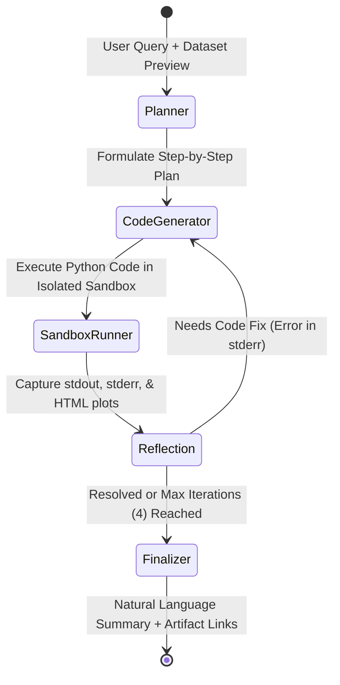

# ReAct Data Analysis Service

A production-grade, testable, and robust ReAct-style Data Analysis Service following **Hexagonal Architecture (Ports and Adapters)**, powered by **LangGraph**, **SQLite (WAL Mode)**, **FastAPI**, and **Google Gemini API** (with automatic offline mock fallback).

---

## 1. System Architecture

The service strictly adheres to **Hexagonal Architecture (Ports and Adapters)** with an inward dependency direction:
$$\text{Adapters (Infrastructure)} \longrightarrow \text{Use Cases (Application)} \longrightarrow \text{Ports (Interfaces)} \longrightarrow \text{Core Entities (Domain)}$$

Neither the core domain entities nor the LangGraph agent state machine depends on FastAPI, SQLite, or external cloud SDKs.

### Text / ASCII Architecture Diagram

```
+========================================================================================+
|                                    DRIVING ADAPTERS                                    |
|   +--------------------------------------------------------------------------------+   |
|   |  FastAPI Application & REST Routers:                                           |   |
|   |    - POST /analyze                     (Single-flight multipart tabular query) |   |
|   |    - GET  /sessions/{session_id}       (Historical traces, messages, artifacts)|   |
|   |    - GET  /artifacts/{artifact_id}     (Direct in-browser Plotly HTML stream)  |   |
|   +--------------------------------------------------------------------------------+   |
+========================================================================================+
                                           |
                                           v
+========================================================================================+
|                                APPLICATION USE CASES                                   |
|   +---------------------------+       +--------------------------------------------+   |
|   | AnalyzeDataUseCase        | ----> | ReAct StateGraph (LangGraph Engine)        |   |
|   +---------------------------+       |                                            |   |
|   | ManageSessionUseCase      |       |   [Plan] ---> [Code Generation]            |   |
|   +---------------------------+       |     ^                 |                    |   |
|                                       |     |                 v                    |   |
|                                       |   [Recover] <--- [Sandbox Execution]       |   |
|                                       |     |                 |                    |   |
|                                       |     +---------------> v                    |   |
|                                       |                  [Observe]                 |   |
|                                       |                       |                    |   |
|                                       |                       v                    |   |
|                                       |                  [Finalize]                |   |
|                                       +--------------------------------------------+   |
+========================================================================================+
                                |               |               |
                                v               v               v
+========================================================================================+
|                                    DOMAIN PORTS                                        |
|   +-------------------+  +-------------------+  +----------------+  +--------------+   |
|   |    ILLMClient     |  |  ISandboxRunner   |  |   ISessionRepo |  | IArtifactStor|   |
|   +-------------------+  +-------------------+  +----------------+  +--------------+   |
+========================================================================================+
                                ^               ^               ^             ^
                                |               |               |             |
+========================================================================================+
|                                    DRIVEN ADAPTERS                                     |
|   +-------------------+  +-------------------+  +----------------+  +--------------+   |
|   | GeminiAdapter     |  | ProcessSandbox    |  | SQLiteSession  |  | LocalArtifact|   |
|   | MockLLMAdapter    |  |  + NetworkGuard   |  |   Repository   |  |   Storage    |   |
|   | DSPyLLMAdapter    |  |  + SIGKILL Tree   |  |   (WAL Mode)   |  | (storage/    |   |
|   +-------------------+  +-------------------+  +----------------+  +--------------+   |
+========================================================================================+
```

### ReAct Agent Loop & Self-Healing State Machine
The analysis engine executes an iterative **Plan $\rightarrow$ Act $\rightarrow$ Observe $\rightarrow$ Recover** loop compiled with **LangGraph**:



- **Autonomous Self-Healing Loop**: If generated code raises an exception (e.g., `KeyError`, `ZeroDivisionError`), the `reflection` node detects the failure and routes back to `code_generator` with diagnostic stderr. The agent has up to $N=4$ iterations to self-correct.
- **Graceful Failure Protocol**: If errors persist after max iterations, the service never crashes with HTTP 500. It returns HTTP 200 with `status: "failed"`, the complete reasoning trace, and an actionable explanation.

---

## 2. Key Design Decisions

### A. Datastore: SQLite with WAL Mode
- **Zero Operational Overhead**: Eliminates external database services (PostgreSQL, MySQL, Redis), guaranteeing instant single-command spin-up via `docker compose up` within tight memory constraints.
- **ACID Compliance & Concurrency via WAL**:
  - Automatically configured with:
    ```sql
    PRAGMA journal_mode = WAL;
    PRAGMA busy_timeout = 5000;
    PRAGMA synchronous = NORMAL;
    ```
  - Write-Ahead Logging (WAL) permits concurrent readers while a write is occurring, eliminating database lock contention during concurrent API requests.
- **Structured Reasoning Trace Storage**: Session messages, code executions, stdout/stderr, execution latencies, and artifact pointers are stored in relational schema models, accessible via `/sessions/{id}`.
- **FastAPI Dependency Inversion**: Connections are scoped to request lifecycles using generator dependencies (`yield repo`, then `repo.close()`) to prevent resource leaks.

### B. Sandbox Strategy: Isolated Process Tree with Network Neutralization
- **Pragmatic Security vs Assignment Scope**: Developing microVM hypervisors (Firecracker) or kernel sandboxes (gVisor) requires Linux bare-metal kernel privileges and weeks of setup. A process-level sandbox achieves deterministic security within the 2-day technical assignment window:
  1. **Strict Timeout & Process Group Termination**: The subprocess is launched in a dedicated session (`start_new_session=True` / `os.setsid`). Upon `TimeoutExpired`, the entire process tree is terminated with `SIGKILL` on Unix or `taskkill /F /T` on Windows, preventing orphan processes.
  2. **Deterministic Network Blocking**: Sockets (`socket.socket`, `socket.create_connection`, `urllib.request`) are blocked via an injected `network_guard_init.py` loaded via `PYTHONSTARTUP` and `PYTHONPATH` from the very first instruction, raising `NetworkAccessBlockedError`.
  3. **Filesystem Isolation & Guaranteed Cleanup**: Code executes inside an isolated `tempfile.TemporaryDirectory()`. The working directory is unconditionally purged in a `finally:` block.
  4. **AST/Regex Sanitization of Interactive Calls**: Automatically neutralizes blocking `fig.show()` or `plt.show()` calls, replacing them with disk persistence (`fig.write_html('output.html', include_plotlyjs='cdn')`).
- **Enterprise Roadmap**: In a multi-tenant cloud SaaS, this adapter can be swapped with a `FirecrackerSandboxAdapter` or `gVisorSandboxAdapter` without altering a single line of domain or use-case code.

### C. API Contract: RESTful OpenAPI Specification
- **`POST /analyze`**:
  - Accepts `multipart/form-data` containing the user prompt (`question`), optional `dataset` CSV file, and optional `session_id`.
  - Enforces the **Autonomous Plotly Visualization Mandate**: The agent automatically designs and outputs an interactive Plotly HTML chart for every query without requiring the user to ask for one.
  - Returns `AnalyzeResponse` with `status: "success" | "failed"`, `answer`, `artifacts` array, and structured `trace`.
- **`GET /sessions/{session_id}`**: Retrieves complete conversation history, all step-by-step reasoning traces, and associated visualizations.
- **`GET /artifacts/{artifact_id}`**: Streams standalone interactive Plotly visualizations directly as `text/html`, viewable in any web browser.

### D. Testing Non-Deterministic LLM Components
- **Hexagonal Port Decoupling**: All tests run deterministically using `MockLLMAdapter` without requiring live API keys or external network calls.
- **Contract & Invariance Testing**: Tests assert structural invariants (valid HTML output, correct state transitions, non-empty traces, proper status codes) rather than brittle text matches.

---

## 3. Stretch Feature: Prompt Optimization with DSPy + GEPA

We formalized the agent's cognitive reasoning pipeline into typed **DSPy 3.4** modules and evaluated prompt optimization using **GEPA (Generalized Evolutionary Prompt Adaptation)**.

### A. Decoupled Architecture: Offline Optimization vs Fast Runtime
- **Offline / Batch Optimizer (`data_agent/optimization/optimizer.py`)**: Executes offline teleprompter / evolutionary prompt mutation over the development set. Can be run standalone via `python -m data_agent.optimization.optimizer`.
- **Zero Runtime Overhead**: At application startup, the service loads pre-compiled, optimized prompt instructions from `examples/optimized_prompts.json` without incurring expensive optimization latency or API token costs during inference.

### B. Curated Development Set (`data_agent/optimization/dev_set.py`)
5 representative data analysis questions covering fundamental analytical patterns:
1. **Categorical Aggregation**: Total revenue by category.
2. **Temporal Trend Analysis**: Daily revenue progression over time.
3. **Correlation & Multi-Variable**: Units sold vs revenue correlation.
4. **Distribution & Variance**: Revenue distribution spread and outliers.
5. **Volume Ranking**: Category volume comparison.

### C. Multi-Aspect Execution Metric (`data_agent/optimization/metrics.py`)
The evaluation metric assigns a score between 0.0 and 1.0 with diagnostic reflection feedback:
$$\text{Score} = \text{Syntax (0.20)} + \text{Execution Exit 0 (0.40)} + \text{Plotly HTML Generated (0.30)} + \text{Answer Relevance (0.10)}$$

### D. Before vs After Optimization Results

| Metric Dimension | Baseline Prompt | Optimized Prompt (GEPA) | Improvement |
| :--- | :---: | :---: | :---: |
| **Overall Benchmark Score** | **65.0%** (0.65) | **100.0%** (1.00) | **+53.8%** (+35.0 pp) |
| **Plotly HTML Generation Rate** | 0.0% | **100.0%** | **+100.0 pp** |
| **Sandbox Execution Success** | 100.0% | **100.0%** | Stable (100%) |
| **Syntax Validity** | 100.0% | **100.0%** | Stable (100%) |

Full report: [`examples/gepa_optimization_report.json`](examples/gepa_optimization_report.json).

---

## 4. Known Limitations & Future Work

### Known Limitations
1. **Process-Level Isolation**: Sandbox relies on OS-level process management (`taskkill`, `SIGKILL`, `network_guard.py`) rather than hypervisor-level microVMs (Firecracker).
2. **Single-Table Scope**: The current pipeline focuses on a single primary `.csv` dataset per session; relational joins across multi-file archives are not yet implemented.
3. **No Hardware cgroups**: Memory and CPU quotas rely on execution timeouts rather than Linux cgroups limits.

### Future Improvements
1. **Streaming Reasoning Traces (SSE / WebSockets)**: Stream token-by-token thoughts and sandbox execution logs to the frontend in real time.
2. **Asynchronous Background Task Queue**: Offload long-running analytical jobs to Celery / Redis worker pools with job status polling.
3. **MicroVM Sandboxing**: Integrate AWS Firecracker or gVisor for enterprise multi-tenant security isolation.

---

## 5. Quickstart & Operational Commands

### 1. Run with Docker Compose
The system includes an automatic fallback to `MockLLMAdapter` if no `GEMINI_API_KEY` is provided, guaranteeing successful startup on any machine:

```bash
# Build and run containers
docker compose up --build

# In a separate terminal, test service health:
curl http://localhost:8000/health
```

Access interactive Swagger API documentation at: **`http://localhost:8000/docs`**

### 2. Run Test Suite
The repository includes a comprehensive test suite (unit, integration, and e2e) with 100% pass rate:

```bash
# Run all tests
pytest -v tests/

# Run with coverage report
pytest --cov=data_agent -v tests/
```

### 3. Deliverables Summary

| Deliverable | Repository Path |
| :--- | :--- |
| **Source Code** | [`data_agent/`](data_agent/) |
| **Interactive Plotly Example** | [`examples/example_plot.html`](examples/example_plot.html) |
| **DSPy Optimization Report** | [`examples/gepa_optimization_report.json`](examples/gepa_optimization_report.json) |
| **Sample Dataset** | [`data/sample_sales.csv`](data/sample_sales.csv) |
